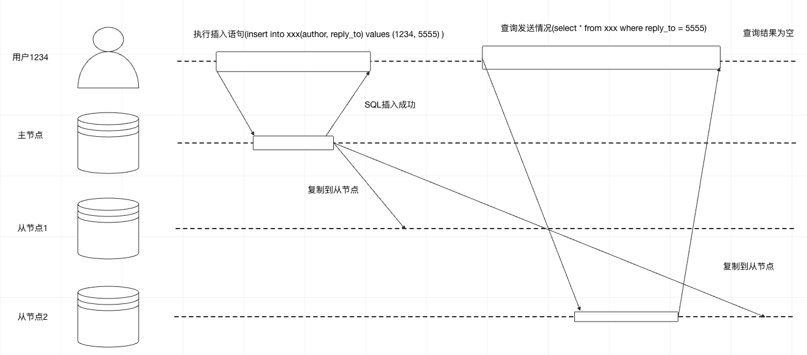
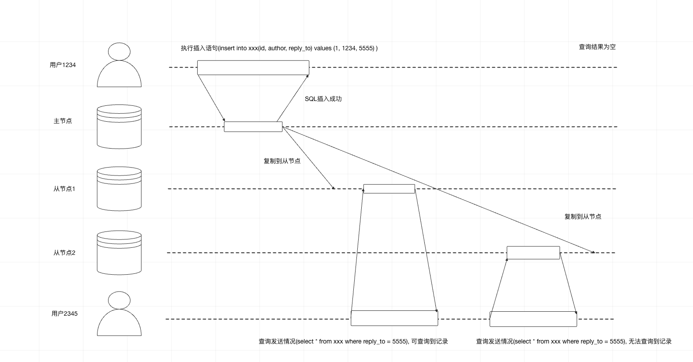

# 数据密集型应用系统设计

- 描述性能

客户端来测量响应时间很重要

# 2. 数据模型与查询语言

## 关系数据库与文档数据库现状

对于高度关联的数据, 文档模型不太适合, 关系模型可以胜任, 而图模型则是最为自然的

# 5. 数据复制

## 主从复制

### 复制滞后问题

- 读自己的写

解决方案

1. 如果用户访问的内容是只有自身可修改的,那么 自己的修改和查询均读取主节点, 访问仅有其他人可修改的内容, 则读取从节点
2. 客户端记住服务端返回的更新时间戳, 读取时带上时间戳, 查询时这条记录的修改时间要大于客户端传过来的时间戳, 如果小于则查下一个db节点, 直到查到大于的为止
3. 建议读从节点的话, 只能读允许最终一致性的数据

- 单调读

同一类查询最好查询同一副本, 当这个副本失效时, 查询下一个副本

解决方案:

1. 同一用户读到的从节点要一致, 根据用户id哈希方法, 选定从节点, 如果该副本失效, 则路由到另一个副本

## 多主复制

好处

1. 提升性能, 用户可以就近访问数据
2. 容灾

处理写冲突

- 避免冲突

通过不同的userid/地理位置固定写入到一个数据中心

- 收敛于一致状态

1. 给每个写入分配一个时间戳, 大的时间戳可写入

## 无主节点复制

客户端直接向多个节点写请求

如果有n个节点, 写入需要w个节点确认, 读取需要r个节点确认, w + r > n 那么读取的节点一定包含最新值

即使在 w +r >n的情况也有可能返回旧值

- 写操作同时发生
- 写和读操作同时发生, 写操作进一部分副本上完成
- 部分副本写入成功, 部分写入失败, 且写入成功数小于w, 那么已成功的副本不会回滚
- 如果具有新值的节点失效, 但恢复数据来自某个旧值, 则总的新值副本会低于w, 打破了之前的判断条件
- 即使一切正常, 也可能出现边界情况, 参考后续可线性化与quorum

这个方案运维侧不好监控旧值情况

- 宽松的quorum与数据回传

在一个大规模集群中, 节点数远大于n, 客户端在网络中断期间,还能连接到某些数据库节点, 但这些节点不是参与仲裁的数据库节点.

如果接受写请求, 只是将他们暂时写入一些可访问的节点里, 注意这些节点并不在原本的n的节点集合中, 这种方案称为放松式仲裁.

写入和读取仍需要w和r的成功响应, 不过w可能是不在原先仲裁的节点里

当网络问题解决, 临时节点需要把接收到的写入全部发送给仲裁节点.